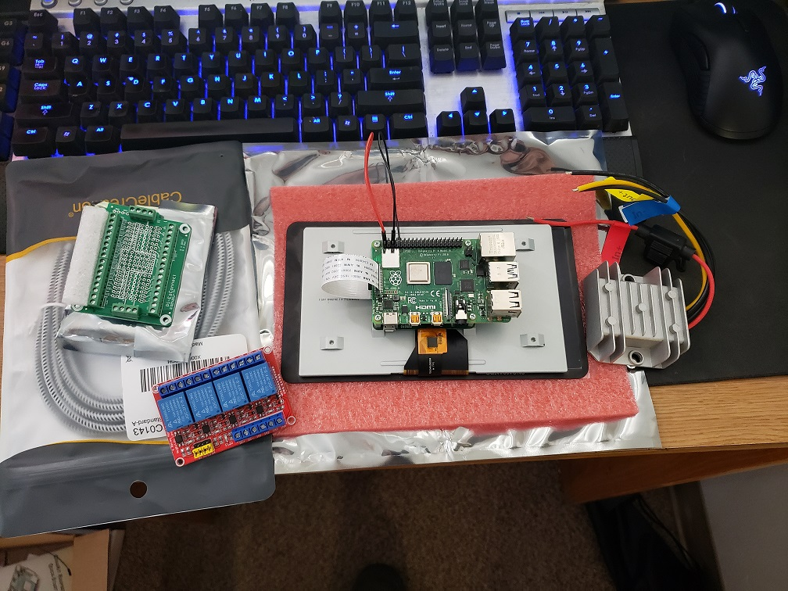

# Car Head Unit Raspberry Pi
This is going to be a side project of mine, I plan on taking a raspberry pi and installing crank shaft/open auot onto to 
simulate andriod auto. I also plan to learn more about raspberry pi and custom things I can do with it inside my car such as control the lighting, turning the heat/ac on from outside my car, or even the heated seats to be turned on from outside.

## Required Parts

Here are some parts I have ordered, I still need to get a few more such as volumn knob 

